## Introduction

1) The class will include 5 sessions: 
  + Session 1  (9-10:20): Data Types in R 
  + Session 2  (10:30-11:20): Control Structures and Functions
  + Session 3  (11:30-12): Statistical Distributions in R
  + Exercise 1 (12:30-1:20): Basic Data Exploration
  + Session 4  (1:20-2:50): Statistical Analysis in R 
  + Session 5  (3:00-4:20): Plotting and Data Visualization in R
  + Exercise 2 (4:20-5:00): Data visualization & Statistical Analysis
  

---


## Introduction

2) We are going to work in pairs. Please find a partner. 

3) Feel free to ask questions anytime during lectures.

4) To access this presentation and the codes used during the workshop please visit:
  + http://ucidatascienceinitiative.github.io/IntroR_Workshop/#1


---

## Session 1 - Agenda

1. RStudio
2. Data Types in R
3. Subsetting in R

---

## What is R?

+ R is a free software environment for statistical computing and graphics
  + See http://www.r-project.org/ for more info
  
  
+ R compiles and runs on a wide variety of UNIX platforms, Windows and Mac OS

+ R is Open-Source and free

+ R is fundamentally a command-driven system

+ R is an object-oriented programming language 
  + everything in R is considered as an object!


--- 


## R Studio:

1. RStudio is a free and open source integrated development environment (IDE) for R.

2. To download RStudio please visit: http://rstudio.org/

3. Please note that you must have R already installed before installing R Studio.

---

## Data Types in R:

1. R has 5 main atomic data types:
  + Numeric
  + Integer
  + Complex
  + Logical
  + Character
  
2. Everything in R is object. Objects can have some attributes.
  + names, dimension, length are some possible attributes

---

## Vectors in R:

Vector is the most basic object in R


```r
numVec <- 1:10 # <- : is assigning operator
numVec
```

```
##  [1]  1  2  3  4  5  6  7  8  9 10
```

```r
charVec <- c("a", "b", "c") # c: to combine elements
charVec
```

```
## [1] "a" "b" "c"
```

```r
logVec <- vector(mode = "logical", length = 10)
logVec
```

```
##  [1] FALSE FALSE FALSE FALSE FALSE FALSE FALSE FALSE FALSE FALSE
```

---

### Special Values:

There are some special values in R:
  + use L to refer to an integer value: 1L
  + R knows infinity: Inf, -Inf
  + NaN: refers to "Not a number"
  

```r
intVec <- c(1L, 2L, 3L, 4L) 
intVec
```

```
## [1] 1 2 3 4
```

```r
a <- Inf; b <- 0
rslt <- c(b/a, a/a)
rslt
```

```
## [1]   0 NaN
```

---

### Logical, Complex, & Character Vectors:

Let's see some examples of logical, complex, and character vectors:

```r
logVec <- c(TRUE, FALSE, FALSE, T, F)
logVec
```

```
## [1]  TRUE FALSE FALSE  TRUE FALSE
```

```r
compVec <- c(1 + 0i, 3 + 1i)
compVec
```

```
## [1] 1+0i 3+1i
```

```r
charVec <- c("red", "green", "blue")
charVec
```

```
## [1] "red"   "green" "blue"
```

---

### Data Type Coercion:

+ In general, vectors CAN NOT have mixed types of objects
+ exception: lists in R 


```r
numCharVec <- c(3.14, "a")
numCharVec # ? what would you expect to be printed?

numLogVec <- c(pi, T)
numLogVec # any guess?

charLogVec <- c("a", TRUE)
charLogVec # ?
```

+ In examples above, we saw implicit coercion 
+ Explicit coercion is also possible!

---

### Data Type Coercion:

+ as(): To explicitly coerce objects from one type to another


```r
numVec <- seq(from = 1200, to = 1300, by = 15)
numVec
```

```
## [1] 1200 1215 1230 1245 1260 1275 1290
```

```r
numToChar <- as(numVec, "character")
numToChar
```

```
## [1] "1200" "1215" "1230" "1245" "1260" "1275" "1290"
```

```r
logVec <- c(F, T, F, T, T)
as(logVec, "numeric")
```

```
## [1] 0 1 0 1 1
```

---

### Data Type Coercion:

+ Coercion does not always work! Be careful about warnings:


```r
compVec <- c(12+10i, 1+6i, -3-2i)
as(compVec, "numeric")
```

```
## Warning: imaginary parts discarded in coercion
```

```
## [1] 12  1 -3
```

```r
charVec <- c("2.5", "3", "2.8", "1.5", "zero")
as(charVec, "numeric")
```

```
## Warning: NAs introduced by coercion
```

```
## [1] 2.5 3.0 2.8 1.5  NA
```

---

### Factors:

+ Factor is a vector object used to specify a discrete classification (categorical values).
+ Factors can be: 1) ordered, 2) un-ordered
+ Levels of a Factor are better to be labeled (self-descriptive)
  + Consider gender as (0, 1) as opposed to labeled ("F", "M")

```r
Gender <- rep(c("Female", "Male"), times = 3)
Gender
```

```
## [1] "Female" "Male"   "Female" "Male"   "Female" "Male"
```

```r
GenderFac1 <- factor(Gender)
GenderFac1
```

```
## [1] Female Male   Female Male   Female Male  
## Levels: Female Male
```

---

### Factors:


```r
levels(GenderFac1)
```

```
## [1] "Female" "Male"
```

```r
table(GenderFac1)
```

```
## GenderFac1
## Female   Male 
##      3      3
```

```r
unclass(GenderFac1) # bring the factor down to integer values
```

```
## [1] 1 2 1 2 1 2
## attr(,"levels")
## [1] "Female" "Male"
```

---

### Factors:

```r
GenderFac1 # levels are ordered alphabetically - 1st level = BaseLevel
```

```
## [1] Female Male   Female Male   Female Male  
## Levels: Female Male
```

```r
GenderFac2 <- factor(Gender, levels = c("Male", "Female"))
GenderFac1
```

```
## [1] Female Male   Female Male   Female Male  
## Levels: Female Male
```

```r
GenderFac2
```

```
## [1] Female Male   Female Male   Female Male  
## Levels: Male Female
```

---

### Missing Values:

+ There are two kinds of missing values in R:
  + NaN: refers to "Not a Number" and is a a missing value produced by numerical computation.
  + NA: When a value is "Not Available" or is "Missing", NA is assigned as its value.

+ NaN is also considered as NA (the reverse is NOT true). 

```r
testScore <- NA
is.na(testScore)
```

```
## [1] TRUE
```

```r
is.nan(testScore)
```

```
## [1] FALSE
```

---

### Matrices:

+ Matrix is a special case of vector:
  + Matrix has dimension attribute


```r
myMat <- matrix(nrow = 2, ncol = 4)
myMat
```

```
##      [,1] [,2] [,3] [,4]
## [1,]   NA   NA   NA   NA
## [2,]   NA   NA   NA   NA
```

```r
attributes(myMat)
```

```
## $dim
## [1] 2 4
```

---

### Matrices:

```r
myMat <- matrix(1:8, nrow = 2, ncol = 4)
myMat # matrices are filled in column-wise
```

```
##      [,1] [,2] [,3] [,4]
## [1,]    1    3    5    7
## [2,]    2    4    6    8
```

---

### Matrix is a special vector:


```r
myVec <- 1:8
myVec
```

```
## [1] 1 2 3 4 5 6 7 8
```

```r
dim(myVec) <- c(2,4)
myVec
```

```
##      [,1] [,2] [,3] [,4]
## [1,]    1    3    5    7
## [2,]    2    4    6    8
```

+ Similar to vectors, all elements of a matrix should have the same type.
  + if not, R does an automatic coercion.

---

### Other Ways to Create Matrix:

+ As it's intuitive, matrices seem to be a combination of vectors that are put next to each other (either column wise or row wise).

+ rbind() (row bind) and cbind (column bind) do a similar job:

```r
vec1 <- 1:4
vec2 <- sample(1:100, 4, replace = FALSE)
vec3 <- rnorm(4, mean = 0, sd = 1)
colMat <- cbind(vec1, vec2, vec3)
colMat
```

```
##      vec1 vec2     vec3
## [1,]    1   88 -0.60388
## [2,]    2   64 -0.07985
## [3,]    3   74  0.89368
## [4,]    4   55  1.85324
```

---

### Other Ways to Create Matrix:


```r
vec1 <- 1:4
vec2 <- sample(1:100, 4, replace = FALSE)
vec3 <- rnorm(4, mean = 0, sd = 1)
rowMat <- rbind(vec1, vec2, vec3)
rowMat
```

```
##         [,1]    [,2]   [,3] [,4]
## vec1  1.0000  2.0000  3.000 4.00
## vec2 21.0000 62.0000 74.000 9.00
## vec3  0.6717  0.1932 -2.489 1.09
```

---

## Lists:

+ Consider list as a vector but with two main differences:
  + each element of a list can have its own class regardless of other elements
  + This means, each element can be of a different data type and a different length

```r
myVec <- c(10, "R", 10-5i, T)
myList <- list(10, "R", 10-5i, T)
myVec
```

```
## [1] "10"    "R"     "10-5i" "TRUE"
```

---

## Lists:


```r
myList <- list(10, "R", 10-5i, T)
myList
```

```
## [[1]]
## [1] 10
## 
## [[2]]
## [1] "R"
## 
## [[3]]
## [1] 10-5i
## 
## [[4]]
## [1] TRUE
```
+ Elements of list are shown with [[]]
+ Elements of vector are shown with []

---

## Data Frames:

+ We use data frames to store tabular data
+ Data frame is a special list where all objects have equal length
+ The main difference between data.frame and Matrix?

```r
studentID <- paste("S#", sample(c(6473:7392), 10), sep = "")
score <- sample(c(0:100), 10)
gender <- sample(c("female", "male"), 10, replace = TRUE)
data <- data.frame(studentID = studentID, score = score, gender = gender)
head(data)
```

```
##   studentID score gender
## 1    S#7075    74 female
## 2    S#6834    68 female
## 3    S#7282    10   male
## 4    S#6903    18 female
## 5    S#7067    98   male
## 6    S#7026     7   male
```

---

## Subsetting:

+ Often times we need to take a subset of a vector, a matrix, a list, or a dataframe.
+ We consider three main operators to take a subset of an object:
  + [ ]: single brackets return an object of the same class of the original object. By using [], we can also choose more than one element.
  + [[ ]]: double brackets are used primarily for lists and dataframes. 
  + "$": is used primarily for lists and dataframes (similar to double brackets). 

+ With [[ ]] and $, we can only choose one object!

+ [[ ]] and $ can return an object with a different class than the original objects we are subsetting from.

---

### Subsetting examples:


```r
myVec <- 10:20
myVec[3]
```

```
## [1] 12
```

```r
myList <- list(obj1 = "a", obj2 = 10, obj3 = T, obj4 = 10-5i)
myList[[3]]
```

```
## [1] TRUE
```

```r
myList$obj3
```

```
## [1] TRUE
```

---

## Subsetting with [ ]:

+ By using single bracket, we can choose more than one element of an object.
+ In this case, index vectors can be very useful:
  + Index vector is a vector of indices of another vector that is used to select a subset of another vector (or Matrix)
  

```r
x <- seq(from=0, to=100,by=10) # length(x) is ??
IndVec <- c(1, 2, 3, 4, 5) # the first 5 elements 
x[IndVec]
```

```
## [1]  0 10 20 30 40
```

---

## Index Vectors:

+ There are four types of Index vectors:
  1. Logical Index Vector: The logical index vector should be of the same length of the vector from which we are selecting a subset. Values corresponding to TRUE in the index vector are selected.
  2. Vector of Positive integers: All the values in this type of index vector must lie in 1:(length(x)).
  3. Vector of Negative integers: This type of index vector indicates the values to be excluded from the
vector.
  4. A Vector of Character Strings: if a vector has a name attribute, we can simply take a subset of the vector by calling the names of the elements.

---

## Index Vectors:

```r
myVec <- letters[1:10]
names(myVec) <- paste("e", 1:10, sep = "")
myVec
```

```
##  e1  e2  e3  e4  e5  e6  e7  e8  e9 e10 
## "a" "b" "c" "d" "e" "f" "g" "h" "i" "j"
```

```r
logIndVec <- rep(c(T, F), each = 5)
logIndVec
```

```
##  [1]  TRUE  TRUE  TRUE  TRUE  TRUE FALSE FALSE FALSE FALSE FALSE
```

```r
posIndVec <- 1:5
negIndVec <- -6:-10
chIndVec <- c("e1", "e2", "e3", "e4", "e5")
```

---

## Index Vectors:

```r
myVec[logIndVec]
```

```
##  e1  e2  e3  e4  e5 
## "a" "b" "c" "d" "e"
```

```r
myVec[negIndVec]
```

```
##  e1  e2  e3  e4  e5 
## "a" "b" "c" "d" "e"
```

```r
myVec[chIndVec]
```

```
##  e1  e2  e3  e4  e5 
## "a" "b" "c" "d" "e"
```

---

## Logical Index Vectors:

+ logical index vectors can be generated by using conditional statements:
  + Using ==, !=, <, >, ...


```r
myVec <- 1:10
logIndVec <- (myVec < 5)
logIndVec
```

```
##  [1]  TRUE  TRUE  TRUE  TRUE FALSE FALSE FALSE FALSE FALSE FALSE
```

```r
myVec[logIndVec]
```

```
## [1] 1 2 3 4
```

---

## Matrix Indexing:
+ Similar to vector indexing, we can refer to individual elements of a matrix.

```r
myMat <- matrix(1:8, ncol = 4)
myMat
```

```
##      [,1] [,2] [,3] [,4]
## [1,]    1    3    5    7
## [2,]    2    4    6    8
```

```r
myMat[1,1] # refering to an element
```

```
## [1] 1
```

```r
myMat[2,] # refering to the second row
```

```
## [1] 2 4 6 8
```

```r
myMat[,3] # refering to the third column
```

```
## [1] 5 6
```

---

## Matrix Indexing:

+ By default, when the retrieved elements of a matrix look like a vector, R drops their dimension attribute. We can turn this feature off by setting drop = FALSE


```r
myMat[1,1]
```

```
## [1] 1
```

```r
myMat[1,1, drop = FALSE]
```

```
##      [,1]
## [1,]    1
```

```r
myMat[2,, drop = FALSE]
```

```
##      [,1] [,2] [,3] [,4]
## [1,]    2    4    6    8
```

---

## Subsetting Lists:

```r
myList <- list(ch = letters[1:2], lg = F, nm = 1:3)
myList
```

```
## $ch
## [1] "a" "b"
## 
## $lg
## [1] FALSE
## 
## $nm
## [1] 1 2 3
```

```r
myList[1] # subset is still a list
```

```
## $ch
## [1] "a" "b"
```

---

## Subsetting Lists:

```r
myList[1:2] # subset is still a list
```

```
## $ch
## [1] "a" "b"
## 
## $lg
## [1] FALSE
```

```r
myList[[1]] # returning the 1st obj with its own class
```

```
## [1] "a" "b"
```

```r
myList$ch # alternative to [[]]
```

```
## [1] "a" "b"
```

---

## Subsetting Lists:

```r
myList[[1]][2] # returning the 2nd element of the 1st obj
```

```
## [1] "b"
```

```r
myList$ch[2]
```

```
## [1] "b"
```

```r
myList[[c(1,2)]]
```

```
## [1] "b"
```

---

## Subsetting Data Frames:

```r
library(datasets)
data(quakes) # ?quakes for more info
str(quakes)
```

```
## 'data.frame':	1000 obs. of  5 variables:
##  $ lat     : num  -20.4 -20.6 -26 -18 -20.4 ...
##  $ long    : num  182 181 184 182 182 ...
##  $ depth   : int  562 650 42 626 649 195 82 194 211 622 ...
##  $ mag     : num  4.8 4.2 5.4 4.1 4 4 4.8 4.4 4.7 4.3 ...
##  $ stations: int  41 15 43 19 11 12 43 15 35 19 ...
```

```r
head(quakes$long)
```

```
## [1] 181.6 181.0 184.1 181.7 182.0 184.3
```

---

## Subsetting Data Frames:


```r
quakes[1:10,]
```

```
##       lat  long depth mag stations
## 1  -20.42 181.6   562 4.8       41
## 2  -20.62 181.0   650 4.2       15
## 3  -26.00 184.1    42 5.4       43
## 4  -17.97 181.7   626 4.1       19
## 5  -20.42 182.0   649 4.0       11
## 6  -19.68 184.3   195 4.0       12
## 7  -11.70 166.1    82 4.8       43
## 8  -28.11 181.9   194 4.4       15
## 9  -28.74 181.7   211 4.7       35
## 10 -17.47 179.6   622 4.3       19
```

---

## Time to Break for 10 Minutes :)

---

## Session 2 - Agenda

1. Vectorized Operations in R
2. Reading and Writing in R
3. Control Structure
4. R Packages and Functions

---

## Vectorized Operations

R is capable of vectorized operations without any need for running loops:

```r
x <- 1:5
y <- c(1, 2, 6, 7, 10)
x + y # R does an element by element summation
```

```
## [1]  2  4  9 11 15
```

```r
x < y
```

```
## [1] FALSE FALSE  TRUE  TRUE  TRUE
```

---

## Vectorized Operations

+ Similar to vectors, vectorized operations can be performed for Matrices:

```r
x <- matrix(1:9, ncol = 3)
y <- matrix(rep(c(5,6,7), 3), ncol = 3)
x + y # R does an element by element summation
```

```
##      [,1] [,2] [,3]
## [1,]    6    9   12
## [2,]    8   11   14
## [3,]   10   13   16
```

```r
x < y
```

```
##      [,1] [,2]  [,3]
## [1,] TRUE TRUE FALSE
## [2,] TRUE TRUE FALSE
## [3,] TRUE TRUE FALSE
```

---

## Reading and Writing Data

**The slides for "Reading and Writing Data" section were mainly from Dr. Roger D. Peng, Associate Professor at Johns Hopkins**

Main functions for reading data into R:

1. read.table(), read.csv(): to read tabular data 
2. readLines(): to read lines of a text file
3. source(), dget(): reading R codes
4. load(): to read saved workspaces

+ Only read.table() and read.csv() are covered in this lecture. 

---

## Reading and Writing Data

Main functions for writing data from R:

1. write.table(), write.csv(): to write tabular data to file
2. writeLines(): to write lines to a text file
3. dump, dput: to write R codes to a file
4. save: to save a workspace

+ Only write.table() is covered in this lecture. 

---

## read.table():

+ read.table() is the most commonly used function to read data in R. Below are important arguments of this function:

  + file: name or address to the file of interest
  + header: logical indicator on whether the file has header or not
  + sep: string on how columns of data are separated (in .csv, sep = ",")
  + colClasses: is a character vector for class of each column
  + nrows: number of rows in the dataset
  + comment.char: a character that is used in the dataset for commenting
  + skip: number of lines to skip from the beginning of the file
  + stringAsFactors: logical indicator on whether characters should be converted to factors 

+ read.csv() is equivalent to read.table with sep = "," and header = TRUE

---

## read.table():


```r
irisFile <- read.table(file = "iris.csv", sep=",", header = TRUE)
head(irisFile)
```

```
##   Sepal.Length Sepal.Width Petal.Length Petal.Width     Species
## 1          5.1         3.5          1.4         0.2 Iris-setosa
## 2          4.9         3.0          1.4         0.2 Iris-setosa
## 3          4.7         3.2          1.3         0.2 Iris-setosa
## 4          4.6         3.1          1.5         0.2 Iris-setosa
## 5          5.0         3.6          1.4         0.2 Iris-setosa
## 6          5.4         3.9          1.7         0.4 Iris-setosa
```

+ to make read.table() run faster:
  + set comment.char = " "
  + set colClasses upfront

---

## Calculating Memory Requirements:

+ Note that datasets will be read into RAM. So, you should have enough RAM in order to read a dataset. 

+ Consider a data frame with 1.5 million rows and 120 columns. How much memory is required to read this dataset?

1.5m * 120 * 8 bytes/numeric = 1.44 * $10^9$ = 1.44 * $10^9$/ $2^{20}$ MB = 1,373.29 MB = 1.34 GB

+ So it's recommended to have a RAM of size 2 * 1.34GB to read that dataset.

---

## write.table():


```r
write.table(irisFile, file = "path/to/the/file")
```

---

## Loops:

+ There are 3 ways in R to write loops:
  + for 
  + repeat (skipped!)
  + while (skipped!)

---

### for:


```r
for(i in 1:4){
  print(paste("cycle #", i, sep = ""))
  i <- i + 1 
}
```

```
## [1] "cycle #1"
## [1] "cycle #2"
## [1] "cycle #3"
## [1] "cycle #4"
```

---

## if:

+ if/else statements are used to write conditional statements


```r
x <- 7
if (x < 10){
  print("x is less than 10")
}else{
  print("x is greater than 10")
}
```

```
## [1] "x is less than 10"
```

---

## if:

```r
age <- sample(1:100, 10)
ageCat <- rep(NA, length(age))
for (i in 1:(length(age))) {
    if (age[i] <= 35){
       ageCat[i] <- "Young"
      }else if (age[i] <= 55){
        ageCat[i] <- "Middle-Aged"
      }else{
         ageCat[i] <- "Old"
      } 
}
age.df <- data.frame(age = age, ageCat = ageCat)
age.df[1:3,]
```

```
##   age      ageCat
## 1  51 Middle-Aged
## 2  30       Young
## 3  34       Young
```

---

## Functions and Packages:

1. R language has many built-in functions
2. Each function has a name followed by ()
3. Arguments of a function are put within parentheses
4. R packages are a comfortable way to maintain collections of R functions and data sets
5. Packages allow for easy, transparent and cross-platform extension of the R base system


---

## Functions and Packages:

There are some terms which sometimes get confused and should be clarified:

1. Package: An extension of the R base system with code, data and documentation in a standardized format
2. Library: A directory containing installed packages
3. Repository: A website providing packages for installation
4. Source: The original version of a package with human-readable text and code
5. Base packages: Part of the R source tree, maintained by R Core

+ for more info on how R packages are developed, please read: "Creating R Packages: A Tutorial" (Friedrich Leisch)
  + http://cran.r-project.org/doc/contrib/Leisch-CreatingPackages.pdf


---

## How to install a package in R:

There are three main ways to install a package in R:

1. Installing from CRAN: install a package directly from the repository
  + Using R studio: tools/install packages
  + From R console: install.packages()

2. Installing from Source: In this method, you should first download the add-on R package and use the following unix command in the console to install the package:
  + R CMD INSTALL packageName -l path/to/your/Rpackage/Directory

3. Installing from a version control (Github): 
  + Check-out https://github.com/hadley/devtools

+ Once you install a package, you need to load it into R using the function library()


---

## Popular Packages in R:

1. To visualize data:
  + ggplot2: to create beautiful graphics
  + googleVis: to use Google Chart tools
  
2. To report results:
  + shiny: to create interactive web-based apps
  + knitr: to combine R codes and Latex/Markdown codes
  + slidify: to build HTML 5 slide shows
  
3. To write high-performance R code:
  + Rcpp: to write R functions that call C++ code
  + data.table: to organize datasets for fast operations
  + parallel: to use parallel processing in R
  

---


## Calling a function in R


```r
str(sample)
```

```
## function (x, size, replace = FALSE, prob = NULL)
```

+ consider sample() in R. Simply run ?sample in R console to read the help on this function.
+ sample() gets four arguments: 
  + x: sample space in form of a vector
  + size: your desired sample size
  + replace: sampling with/without replacement
  + prob: a vector of probability weights

+ some of the arguments have default values. What are those arguments?

+ How to use (or call) this function? 


---

## Calling a function in R


```r
# Functions arguments can be matched: 1) by position or 2) by name
sampSpace <- 1:6 # rolling a die
sample(sampSpace, 1) # arguments with default values can be omitted
```

```
## [1] 4
```

```r
sample(size = 1, x = sampSpace) # no need to remember the order 
```

```
## [1] 1
```

```r
sample(size = 1, sampSpace)
```

```
## [1] 1
```


---

## Writing your Own functions


```r
yourFnName <- function(<your arguments>){
  # body of your code
  
  # return the output of the function
}

# to use your function, you can simply call the function name as:
yourFnName(<set values for the input arguments>)
```


---

## Writing your Own functions

+ Let's write a function that gets three arguments: a, b, c
+ The function then returns min of these two numbers


```r
myMin <- function(a, b, c){
  myMinVal <- min(a, b, c)
  return(myMinVal)
}

myMin(10, 20, 30)
```

```
## [1] 10
```

```r
myMin(10, NA, 20) # ? how to fix this so it returns 10
```

```
## [1] NA
```


---

## Some notes on Functions

> 1. Variables defined within a function are locally defined (i.e. not defined outside of the function).

> 2. Functions in R are treated like any other first class objects. This means functions can be passed as arguments of other functions.

> 3. Arguments of functions are evaluated as they are needed (lazy evaluation). 

> 4. " ... " can be an argument of a function and it refers to a situation where number of input arguments can be varied and is not fixed upfront. 


---

## Lazy Evaluation of Function Arguments


```r
myLazyFn1 <- function(a, b){
  return(a)
}
myLazyFn1(10) # No error!
```

```
## [1] 10
```

```r
myLazyFn2 <- function(a, b){
  print(a)
  print(b)
  return(1)
}
myLazyFn2(10) 
```

```
## [1] 10
```

```
## Error in print(b): argument "b" is missing, with no default
```


---

## Some useful functions:

+ Here we are going to talk about:
  + str(): a function to explain internal structure of a function
  + apply(): to apply a function to a matrix or dataframe
  + lapply(), sapply(), tapply(), mapply(): applying a function to a vector
  + split(): to split a dataset by levels of a factor


---

### str():

+ str() is a compact way of understanding what an object is and what is in that object.

```r
str(str)
```

```
## function (object, ...)
```

```r
str(sample)
```

```
## function (x, size, replace = FALSE, prob = NULL)
```

```r
genderF <- factor(sample(c("Male", "Female"), 20, replace = TRUE))
str(genderF)
```

```
##  Factor w/ 2 levels "Female","Male": 1 2 1 2 1 1 1 2 2 1 ...
```


---

### str():

```r
myMat <- matrix(1:10, ncol = 5)
str(myMat)
```

```
##  int [1:2, 1:5] 1 2 3 4 5 6 7 8 9 10
```

```r
myList <- list(numVec = 1:3, logVec = F, charVec = LETTERS[1:4])
str(myList)
```

```
## List of 3
##  $ numVec : int [1:3] 1 2 3
##  $ logVec : logi FALSE
##  $ charVec: chr [1:4] "A" "B" "C" "D"
```


---

### apply():


```r
str(apply) # try ?apply for more info
```

```
## function (X, MARGIN, FUN, ...)
```

+ apply() is a useful function to apply a function (FUN) on a MARGIN of a matrix or dataframe (X)

+ MARGIN: a vector giving the subscripts which the function will be applied over
  + 1: indicates rows
  + 2: indicates columns
  + c(1, 2): indicates rows and columns

+ FUN: refers to the function that we want to apply on the dataset

+ "..." : additional arguments of FUN


---

### apply():


```r
myMat <- matrix(1:10, ncol = 5)
myMat[2,c(2, 5)] <- NA
myMat
```

```
##      [,1] [,2] [,3] [,4] [,5]
## [1,]    1    3    5    7    9
## [2,]    2   NA    6    8   NA
```

```r
apply(myMat, 2, sum, na.rm = TRUE)
```

```
## [1]  3  3 11 15  9
```


---

### apply():


```r
# consider iris dataset: 
head(iris) # more info ?iris
```

```
##   Sepal.Length Sepal.Width Petal.Length Petal.Width Species
## 1          5.1         3.5          1.4         0.2  setosa
## 2          4.9         3.0          1.4         0.2  setosa
## 3          4.7         3.2          1.3         0.2  setosa
## 4          4.6         3.1          1.5         0.2  setosa
## 5          5.0         3.6          1.4         0.2  setosa
## 6          5.4         3.9          1.7         0.4  setosa
```

```r
# suppose we are interested in getting 25% and 75% of each numeric column
```


---

### apply():


```r
# Consider iris dataset: 
apply(iris[,-5], 2, quantile, probs = c(0.25, 0.75))
```

```
##     Sepal.Length Sepal.Width Petal.Length Petal.Width
## 25%          5.1         2.8          1.6         0.3
## 75%          6.4         3.3          5.1         1.8
```


---

### lapply() and sapply():


```r
str(lapply)
```

```
## function (X, FUN, ...)
```

```r
str(sapply)
```

```
## function (X, FUN, ..., simplify = TRUE, USE.NAMES = TRUE)
```
+ x: a list, dataframe, or a vector
+ FUN: the function to be applied to each element of X
+ "...": other arguments of FUN


---

### lapply() and sapply():

```r
myList <- list(e1 = 1:10, e2 = -1:-10)
lapply(myList, mean)
```

```
## $e1
## [1] 5.5
## 
## $e2
## [1] -5.5
```

```r
sapply(myList, mean)
```

```
##   e1   e2 
##  5.5 -5.5
```


---

### lapply() v. sapply()?:

+ sapply() simplifies the result of lapply.
  
+ If the result of lapply is a list with all elements of the same length:
    + if length == 1: sapply() returns a vector
    + if length != 1: sapply() returns a matrix
    
+ otherwise, sapply() generates a list similar to lapply()


---

### lapply() & sapply() with a user-defined FUN

```r
myList <- list(e1 = 1:10, e2 = -1:-10)
lapply(myList, function(element){return(mean(c(element[1], element[length(element)])))})
```

```
## $e1
## [1] 5.5
## 
## $e2
## [1] -5.5
```

```r
sapply(myList, function(element){return(mean(c(element[1], element[length(element)])))})
```

```
##   e1   e2 
##  5.5 -5.5
```


---

### tapply():

```r
str(tapply)
```

```
## function (X, INDEX, FUN = NULL, ..., simplify = TRUE)
```

+ tapply() applies a function on a subset of a vector
+ X: is a vector 
+ INDEX: list of one or more factors, each of same length as X
+ FUN: our function of interest
+ "...": other arguments of FUN
+ simplify: any guess???


---

### tapply():

```r
HeightDF <- data.frame(heigth = c(rnorm(100, 180, 3), rnorm(100, 170, 3)), gender = factor(rep(c("M", "F"), each = 100)))
head(HeightDF)
```

```
##   heigth gender
## 1  179.4      M
## 2  178.1      M
## 3  182.9      M
## 4  177.3      M
## 5  183.0      M
## 6  184.2      M
```

```r
tapply(HeightDF$heigth, HeightDF$gender, mean)
```

```
##     F     M 
## 169.9 180.1
```


---

### mapply():

```r
str(mapply)
```

```
## function (FUN, ..., MoreArgs = NULL, SIMPLIFY = TRUE, USE.NAMES = TRUE)
```
  
+ all previous "apply" functions were univariate
  + f(x, {some other parameters})
  
+ What to do if we want to apply a multivariate function:
  + f(x, y, {some other parameters}) # we can have more than 2 variables 


---

### mapply():

```r
l1 <- list(e1 = 1:10, e2 = 1:10)
l2 <- list(e1 = -1:-10, e2 = -1:-10)
# how to get l1$e1[i] + l1$e2[i] + l2$e1[i] + l2$e2[i] ? 
mapply(sum, l1$e1, l1$e2, l2$e1, l2$e2)
```

```
##  [1] 0 0 0 0 0 0 0 0 0 0
```


---

### split():

```r
str(split) # ?split for more info
```

```
## function (x, f, drop = FALSE, ...)
```

+ X: a vector or a data frame
+ f: factor
+ drop: should R drop empty factor levels?


---

### split():

```r
str(HeightDF)
```

```
## 'data.frame':	200 obs. of  2 variables:
##  $ heigth: num  179 178 183 177 183 ...
##  $ gender: Factor w/ 2 levels "F","M": 2 2 2 2 2 2 2 2 2 2 ...
```

```r
# Goal: to separate Females from Males
splitData <- split(HeightDF$heigth, HeightDF$gender)
str(splitData)
```

```
## List of 2
##  $ F: num [1:100] 171 170 169 173 167 ...
##  $ M: num [1:100] 179 178 183 177 183 ...
```


---


## Time for Break for 10 Minutes :)


---


## Session 3 - Agenda

1. Useful Matrix Functions
2. Statistical Distributions in R

---


## Useful Matrix Functions

Consider matrix "A". We can then have:
> 1. t(A): transpose of A
> 2. solve(): to get inverse of A
> 3. eigen(): to get eigen values and eigen vectors (if A is symmetric)
> 4. We only cover solve() in this lecture

---

### solve():
+ Consider B = A %*% X (where X is an unknown matrix)
+ Then: X = solve(A, B)
+ In a special case where B = I, X = $A^{-1}$


```r
A <- matrix(c(1, 2, 3, 2, 4, 5, 3, 5, 6), ncol = 3)
A
```

```
##      [,1] [,2] [,3]
## [1,]    1    2    3
## [2,]    2    4    5
## [3,]    3    5    6
```

```r
# to get inverse of A: solve(A)
```

---

### solve():

```r
solve(A)
```

```
##      [,1] [,2] [,3]
## [1,]    1   -3    2
## [2,]   -3    3   -1
## [3,]    2   -1    0
```

```r
# To check that solve(A) is inverse of A:
solve(A)%*%A
```

```
##      [,1] [,2]       [,3]
## [1,]    1    0  0.000e+00
## [2,]    0    1 -8.882e-16
## [3,]    0    0  1.000e+00
```
+ Machine epsilon is defined to be the smallest positive number which, when added to 1, gives a number different from 1.
+ Please visit http://en.wikipedia.org/wiki/Machine_epsilon for more info

---

## Statistical Distributions in R:

+ R has many in-built statistical distributions
  + examples: binomial, poisson, normal, chi square, ...

+ Each distribution in R has four functions:
  + these functions begin with a "d", "p", "q", or "r" and are followed by the name of the distribution

+ ddist(parameters): refers to the density of each distribution
+ rdist(parameters): generates random numbers out of each distribution
+ qdist(parameters): to get quantile of a distribution
+ pdist(parameters): to calculate CDF


---

### Example of a Discrete Distribution:

```r
# Consider tossing a coin 10 times
str(dbinom)
```

```
## function (x, size, prob, log = FALSE)
```

```r
dbinom(5, 10, 0.5) # prob of getting five heads
```

```
## [1] 0.2461
```

```r
str(pbinom) # cumulative dist
```

```
## function (q, size, prob, lower.tail = TRUE, log.p = FALSE)
```

```r
pbinom(5, 10, 0.5) # Pr[X <= 5]
```

```
## [1] 0.623
```


---

### Example of a Discrete Distribution:

```r
str(qbinom) # quantile: Pr[X <= ?] = known value
```

```
## function (p, size, prob, lower.tail = TRUE, log.p = FALSE)
```

```r
qbinom(0.6230, 10, 0.5) # get the value of ? s.t. Pr[X <= ?]=0.6230
```

```
## [1] 5
```

```r
str(rbinom) # Generating random numbers
```

```
## function (n, size, prob)
```

```r
rbinom(20, 10, 0.5) # 20 ind samples from binomial(10, 0.5)
```

```
##  [1] 5 6 5 6 4 7 5 3 7 5 3 7 5 2 5 6 4 6 6 3
```


---

### Example of a Continuous Distribution:

```r
# Consider a standard Normal distribution
str(dnorm)
```

```
## function (x, mean = 0, sd = 1, log = FALSE)
```

```r
dnorm(x = 0, mean = 0, sd = 1, log = FALSE)
```

```
## [1] 0.3989
```

```r
str(pnorm) # cumulative dist
```

```
## function (q, mean = 0, sd = 1, lower.tail = TRUE, log.p = FALSE)
```

```r
pnorm(0, mean = 0, sd = 1)
```

```
## [1] 0.5
```


---

### Example of a Continuous Distribution:

```r
str(qnorm) # quantile
```

```
## function (p, mean = 0, sd = 1, lower.tail = TRUE, log.p = FALSE)
```

```r
qnorm(0.5, mean = 0, sd = 1)
```

```
## [1] 0
```

```r
str(pnorm) # cumulative dist
```

```
## function (q, mean = 0, sd = 1, lower.tail = TRUE, log.p = FALSE)
```

```r
rnorm(10, mean = 0, sd = 1)
```

```
##  [1] -2.0271 -0.5438  1.0976  0.3732 -0.5845 -0.8784 -1.5606  1.0805
##  [9]  1.0381  0.9862
```


---

### Example of a Continuous Distribution:

```r
# Let's try plotting Normal curve (more on plotting later)
x <- seq(from = -3, to = 3, by = 0.05)
y <- dnorm(x, mean = 0, sd = 1)
plot(x, y, type = "l")
```


---


## Time for Lunch Break for 30 Minutes. Please come back at 12:30 :)


---

## Exercises: Analysis for Auto-Mpg Data

1. Dataset: Auto-Mpg Data from UCI Machine Learning Repository (some modification is done on the data for the exercise of this workshop)
2. Download: click the "download" button in slide 1, extract the zip file and the data files will be in the folder "data"
3. Variables (names saved in auto-mpg-names.txt): 
  + continuous: mpg, displacement, horsepower, weight, acceleration
  + discrete: cylinders, model year, origin
  + string: car name (not used in the analysis)
  + descriptions: mpg (city-cycle fuel consumption in miles per gallon), cylinders (# of cylinders), displacement (engine displacement in cu. inches), weight (vehicle weight in lbs.), accelerate (time to accelerate from O to 60 mph in sec.), model year (modulo 100), origin (1: American, 2: European, 3: Japanese).
4. More information:   https://archive.ics.uci.edu/ml/datasets/Auto+MPG

---

## Questions to answer
1. Does mpg depend on the origin of the car?
2. How is mpg related with #cylinders of the car?
3. How is mpg related with other variables?
4. Predict mpg using the other variables provided in the data.

---

# Some suggestions
  + First skip the optional problems, especially if you are very new to R; if you still have time after finishing all the regular problems, come back to work on the optional ones
  + Disable "hide file extensions" so you can easily see the full file names
  + Feel free to ask us for help
  + Try to solve the exercises without looking at the solutions (ex_code.r)

---

## EX0. Getting ready
# Overview of data analysis
Data checking & cleaning, data visualization, data transformation, statistical modeling
# R script
open a new R script file to write and save your code for the exercises. 
# Execute code
to execute the code you can either highlight the code and press Ctrl+Enter (Cmd+Return), or copy and paste the code to the console and press Enter (Return).


---


## EX1. Import data
# 1.1 Set working directory
find the folder where the data files are saved, and set working directory to that folder using setwd().
# 1.2  Import CSV file
use read.csv() to import the data "auto-mpg.csv" (the data is of comma separated value file format), and store it as an object "data" ( data = read.csv(....) ). We need to set header = FALSE since the data starts right from the first line (i.e. the data has no header). Look at the data set to see what string/symbols are used to denote missing values; in this data "NA" is used, so na.strings = "NA" should be specified in read.csv(). 
# 1.3 (optional) Other data format
Read data file "auto-mpg.data-original.txt". What happens and why? Check the original data file. 

---

## EX2. Check data
# 2.1 Variables and Values
check the top few rows of data; open the original data in excel or notepad and compare with the rows printed in R.  
# 2.2. Dimension
check the dimension of data

---

## EX3. Add variable names
# 3.1 Import variable names
import variable names from "auto-mpg-names.txt" using readLines() and store as an object "varnames" (varnames = readLines(...)). Type "varnames" in the console to see what's inside. The difference between readLines() and read.table() is that readLines() imports the data file into a vector of strings, but read.table() imports the data file into a data frame. Each element of the vector returned by readLines() is the content of an entire line in the data file.
# 3.2 Name the variables
Run "names(data)". It returns the variable names of the data. Assign the new variable names to data by "names(data) = varnames". Check again the variable names, to see if they are updated correctly.

---

## EX4. Data summary
# 4.1 Summarize data structure
summarize the data structure and the class of each column (use str() );
# 4.2 Summarize data content
apply function summary() on data and see how it is different from the function above. One nice thing is that it tells you #missing values for each variable (NA's). 

---

## EX5. Subset exercises 
# 5.1 Subset single variable
summarize the variable mpg (use summary()). (There are 3 ways you can get the variable mpg.) Do you see something weird in the result? What might be the reason? We will get back to this later. 

# 5.2 Subset multiple variables (columns)
create a vector "index_cont" in R for the numbers 1,3,4,5,6, which are the column indices for the continuous variables; use that vector to extract the continuous variables and summarize the continuous variables (use summary()).

---

# 5.3 (optional) Subset the complement set  
use the index vector you created above to extract the non-continuous variables and summarize them ( using "-index_cont" for subsetting will return the complement of "index_cont");

# 5.4 (optional) Subset the instances
read the help file for which(); create a vector of indices "index_origin_23" for the instances (rows) where origin is 2 or 3; create a new data that contains only the instances where origin is 2 or 3. Hint: logical operator: & for and, | for or, ! for NOT.    

# 5.5 Drop a variable
drop variable "car_name" (we will not use it in our analysis). Check the top few lines of the data. Hint: you can either assign NULL (empty) to the variable "car_name", or redefine data to be the subset of the data that does not contain "car_name". 

---

## EX6. Discrete variables 
# 6.1 Make a copy of the data
we are going to change the data, so please first make a copy of the original data (assign data to a new object "data_ori"); in case you do something wrong later you can easily reset the new data to be the original data.
# 6.2 Convert numerical to factor
origin is a categorical variable by nature, so we need to convert it to a factor type (use factor()), and assign it back to data$origin. 
# 6.3 Add labels
run "levels(data$origin)" to see the current labels for the variable origin. Change the labels for the values (1: American, 2: European, 3:Japanese). 
# 6.4 Summarize a factor variable
use summary() on the converted variable and see how the summary output changes for a factor variable. 

---

## EX7. Missing values
# 7.1 Fix inappropriate coding 
recall the weird values '-99' we saw before in 'mpg'. Sometimes the coding gets messed up and the unlikely values like "-99" are used to code missing values - in which case we should confirm this with the data entry clerk. Now assuming this has been confirmed, let's replace all "-99" with NA (not "NA").  
# 7.2 Data check
use summary(data) to check if every variable looks reasonable now. Note: in reality, even dirtier data coding could happen, e.g. multiple bad codings, in which case histograms and boxplots will be useful - since we are able to see all weird values at the same time. Similar as checking outliers.  


---


# 7.3 Check missing values
calculate the total number of missing values in data (use is.na() and sum()). And then rewrite it to make it a function total_NAs(x) that returns the total number of missing values in the dataset given in the argument "x". Test your function on the current data, it should return 17. 
# 7.4 Discard missing values
read the help file for function na.omit(), and use this function to create a new data (store it as data_noNA) that contains only the instances that has no missing value on any variables 

---

# From now on use the data set that contains no missing values
# EX8. (optional) *apply() & split()
  + 8.1 use one of the *apply() functions to get the frequency table on all discrete variables. Note that if these variables were all of factor type instead of numerical type, this could be directly done by summary(data[,c(2,7,8)]) 
  + 8.2 find average mpg for each # cylinders
  + 8.3 find 2.5 and 97.5 percentile of mpg for each # cylinders 
  + 8.4 split the dataset based on # cylinders 


---

# EX9. (optional) Loop, subset & sample
Randomization testing for whether mean mpg is higher for Japanese cars than European cars
  + 9.1 calculate the difference between mean mpg for Japanese cars and European cars and save in object dif_JapVSEuro
  + 9.2 find the number of instances for European cars and save in object n_European
  + 9.3 write a for loop that does the following in each iteration:
     + find the subset of European cars and Japanese cars
     + randomize the origin of the cars: randomly sample n_European instances to be "European" and the rest to be "Japanese"
     + calculate the new difference in the mean mpg of the randomized data (Jap - Euro)
     + record whether the new difference >= the observed difference, dif_JapVSEuro
  + 9.4 run the simulation of 1000 iterations

---

+ 9.5 obtain the p value by calculating the proportion of times that the difference of the randomized data >= the observed difference. If this p value <= the alpha level we set for the test, then we can conclude mean mpg is higher for Japanese cars than European cars. 

---


## Session 4 - Agenda

1. T-Test in R
2. ANOVA in R
3. Linear Regression in R
4. Logistic Regression in R


---

## T-Test in R

T-tests can be categorized into two groups:
  + 1) One-Sample t-test
  + 2) two-sample t-test


---

###  One-Sample T-Test

```r
oneSampData <- rnorm(100, mean = 0, sd = 1)
oneSampTest.0 <- t.test(oneSampData) # ?t.test
oneSampTest.0
```

```
## 
## 	One Sample t-test
## 
## data:  oneSampData
## t = -1.1455, df = 99, p-value = 0.2548
## alternative hypothesis: true mean is not equal to 0
## 95 percent confidence interval:
##  -0.2914727  0.0781128
## sample estimates:
## mean of x 
##  -0.10668
```


---

###  One-Sample T-Test

```r
names(oneSampTest.0) # alternative to names()?? 
```

```
## [1] "statistic"   "parameter"   "p.value"     "conf.int"    "estimate"   
## [6] "null.value"  "alternative" "method"      "data.name"
```


---

###  Two-Sample T-Test
Two sample t-tests are categorized into 3 groups:
  + T-Test with equal variances
  + T-Test with un-equal variances
  + Paired T-Test: can be also considered as one-sample t-test on deltas.


---

###  Two-Sample T-Test (Un-equal Variances)

```r
Samp1 <- rnorm(30, mean = 2.5, sd = 1)
Samp2 <- rnorm(50, mean = 5.5, sd = 1)
t.test(Samp1, Samp2)  # default assump: unequal variances
```

```
## 
## 	Welch Two Sample t-test
## 
## data:  Samp1 and Samp2
## t = -13.6442, df = 67.594, p-value < 2.2e-16
## alternative hypothesis: true difference in means is not equal to 0
## 95 percent confidence interval:
##  -3.377306 -2.515404
## sample estimates:
## mean of x mean of y 
##  2.641157  5.587511
```


---

###  Two-Sample T-Test (Equal Variances)

```r
t.test(Samp1, Samp2, var.equal = TRUE)  # default assump: unequal variances
```

```
## 
## 	Two Sample t-test
## 
## data:  Samp1 and Samp2
## t = -13.1985, df = 78, p-value < 2.2e-16
## alternative hypothesis: true difference in means is not equal to 0
## 95 percent confidence interval:
##  -3.390781 -2.501929
## sample estimates:
## mean of x mean of y 
##  2.641157  5.587511
```


---

###  Two-Sample T-Test (Paired T Test)

```r
t.test(Samp1, Samp2[1:30], paired = TRUE)
```

```
## 
## 	Paired t-test
## 
## data:  Samp1 and Samp2[1:30]
## t = -10.0819, df = 29, p-value = 5.483e-11
## alternative hypothesis: true difference in means is not equal to 0
## 95 percent confidence interval:
##  -3.279760 -2.173502
## sample estimates:
## mean of the differences 
##               -2.726631
```


---

##  ANOVA
If you are not familiar with ANOVA, simply consider ANOVA as an extension to two-sample t-test where we have more than two groups.


```r
Samp1 <- round(rnorm(10, mean = 25, sd = 1), 1)
Samp2 <- round(rnorm(10, mean = 30, sd = 1), 1)
Samp3 <- round(rnorm(10, mean = 35, sd = 1), 1)
myDF <- data.frame(y = c(Samp1, Samp2, Samp3), group = rep(c(1, 2, 3), each = 10))
myDF$group <- as.factor(myDF$group)
str(myDF)
```

```
## 'data.frame':	30 obs. of  2 variables:
##  $ y    : num  25 25.5 24.1 26.3 25.4 25.9 26.1 26.8 27.5 24.9 ...
##  $ group: Factor w/ 3 levels "1","2","3": 1 1 1 1 1 1 1 1 1 1 ...
```


---

##  ANOVA

```r
ANOVAfit <- lm(y ~ group, data = myDF)  # instead of lm, aov() can also be used!
myANOVA <- anova(ANOVAfit)  # anova computes analysis of variance tables on a fitted model object.
str(myANOVA) # see what is 
```

```
## Classes 'anova' and 'data.frame':	2 obs. of  5 variables:
##  $ Df     : int  2 27
##  $ Sum Sq : num  462.1 22.5
##  $ Mean Sq: num  231.074 0.834
##  $ F value: num  277 NA
##  $ Pr(>F) : num  1.01e-18 NA
##  - attr(*, "heading")= chr  "Analysis of Variance Table\n" "Response: y"
```


---

##  ANOVA
+ To learn more on how to fit ANOVA, please visit: 
  + http://www.statmethods.net/stats/anova.html
  

---

##  Linear Regression- Data:
+ lm() is used to fit linear regression
+ Here we use "Prestige" dataset from "car" package

```r
# install.package("car")
library(car)
data(Prestige) # load the data
str(Prestige)
```

```
## 'data.frame':	102 obs. of  6 variables:
##  $ education: num  13.1 12.3 12.8 11.4 14.6 ...
##  $ income   : int  12351 25879 9271 8865 8403 11030 8258 14163 11377 11023 ...
##  $ women    : num  11.16 4.02 15.7 9.11 11.68 ...
##  $ prestige : num  68.8 69.1 63.4 56.8 73.5 77.6 72.6 78.1 73.1 68.8 ...
##  $ census   : int  1113 1130 1171 1175 2111 2113 2133 2141 2143 2153 ...
##  $ type     : Factor w/ 3 levels "bc","prof","wc": 2 2 2 2 2 2 2 2 2 2 ...
```

---

##  Linear Regression- Data Description: 

+ education: Average education of occupational incumbents, years, in 1971.

+ income: Average income of incumbents, dollars, in 1971.

+ women: Percentage of incumbents who are women.

+ prestige :Pineo-Porter prestige score for occupation, from a social survey conducted in the mid-1960s.

+ census: Canadian Census occupational code.

+ type: Type of occupation. A factor with levels (note: out of order): bc, Blue Collar; prof, Professional, Managerial, and Technical; wc, White Collar.


---

##  Linear Regression - Fit:

```r
myReg <- lm(prestige ~ education + income + women, data = Prestige)
myReg # summary(myReg)
```

```
## 
## Call:
## lm(formula = prestige ~ education + income + women, data = Prestige)
## 
## Coefficients:
## (Intercept)    education       income        women  
##   -6.794334     4.186637     0.001314    -0.008905
```

```r
names(myReg)
```

```
##  [1] "coefficients"  "residuals"     "effects"       "rank"         
##  [5] "fitted.values" "assign"        "qr"            "df.residual"  
##  [9] "xlevels"       "call"          "terms"         "model"
```
  

---

##  Linear Regression - Summary of Fit:

```r
summary(myReg) # summary(myReg)
```

```
## 
## Call:
## lm(formula = prestige ~ education + income + women, data = Prestige)
## 
## Residuals:
##      Min       1Q   Median       3Q      Max 
## -19.8246  -5.3332  -0.1364   5.1587  17.5045 
## 
## Coefficients:
##               Estimate Std. Error t value Pr(>|t|)    
## (Intercept) -6.7943342  3.2390886  -2.098   0.0385 *  
## education    4.1866373  0.3887013  10.771  < 2e-16 ***
## income       0.0013136  0.0002778   4.729 7.58e-06 ***
## women       -0.0089052  0.0304071  -0.293   0.7702    
## ---
## Signif. codes:  0 '***' 0.001 '**' 0.01 '*' 0.05 '.' 0.1 ' ' 1
## 
## Residual standard error: 7.846 on 98 degrees of freedom
## Multiple R-squared:  0.7982,	Adjusted R-squared:  0.792 
## F-statistic: 129.2 on 3 and 98 DF,  p-value: < 2.2e-16
```


---

##  Linear Regression - Predict
+ Predict the output for a new input

```r
newData = data.frame(education=13.2, income=12000, women=12);
predict(myReg, newData, interval="predict");
```

```
##        fit    lwr      upr
## 1 64.12514 48.358 79.89229
```


---


##  Linear Regression - Confidence Interval:
+ 95% confidence interval for coefficient of 'income'

```r
confint(myReg, 'income', level=0.95)
```

```
##               2.5 %      97.5 %
## income 0.0007623127 0.001864808
```

+ 95% confidence interval for each coefficient

```r
confint(myReg, level=0.95)
```

```
##                     2.5 %       97.5 %
## (Intercept) -1.322220e+01 -0.366468202
## education    3.415272e+00  4.958002277
## income       7.623127e-04  0.001864808
## women       -6.924697e-02  0.051436660
```
  
---

##  Linear Regression - Diagnostics:
+ Here we cover some common regression diagnostics including:
  + Testing for Normality
  + Testing for Constant Variance
  
+ Reference: http://www.statmethods.net/stats/rdiagnostics.html
  

---
## Model diagnostic plot

```r
par(mfrow = c(2, 2), oma = c(0, 0, 2, 0))
plot(myReg)
```

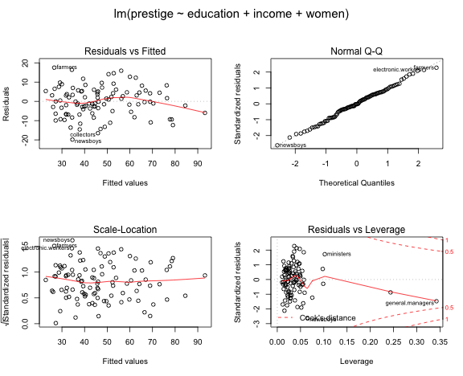 

---

##  Logistic Regression - Data:
+ glm() is used to fit logistic regression model

+ Mroz data

library(car)
data(Mroz); # load Mroz data


```r
head(Mroz)
```

```
##   lfp k5 k618 age  wc hc       lwg    inc
## 1 yes  1    0  32  no no 1.2101647 10.910
## 2 yes  0    2  30  no no 0.3285041 19.500
## 3 yes  1    3  35  no no 1.5141279 12.040
## 4 yes  0    3  34  no no 0.0921151  6.800
## 5 yes  1    2  31 yes no 1.5242802 20.100
## 6 yes  0    0  54  no no 1.5564855  9.859
```

---

## Logistic Regression - Data Description

+ lfp: labor-force participation; a factor with levels: no; yes.
+ k5: number of children 5 years old or younger.
+ k618: number of children 6 to 18 years old.
+ age: in years.
+ wc: wife's college attendance; a factor with levels: no; yes.
+ hc: husband's college attendance; a factor with levels: no; yes.
+ lwg: log expected wage rate; for women in the labor force, the actual wage rate; for women not in the labor force, an imputed value based on the regression of lwg on the other variables.
+ inc: family income exclusive of wife's income.
  

---

## Logistic Regression - Model Fit

```r
fitLogistic <- glm(lfp ~ k5 + age, 
                   family=binomial(logit), data=Mroz); 
fitLogistic # summary(fitLogistic)
```

```
## 
## Call:  glm(formula = lfp ~ k5 + age, family = binomial(logit), data = Mroz)
## 
## Coefficients:
## (Intercept)           k5          age  
##     3.08578     -1.32042     -0.05847  
## 
## Degrees of Freedom: 752 Total (i.e. Null);  750 Residual
## Null Deviance:	    1030 
## Residual Deviance: 964.5 	AIC: 970.5
```

---


## Logistic Regression - Model Fit

```r
names(fitLogistic)
```

```
##  [1] "coefficients"      "residuals"         "fitted.values"    
##  [4] "effects"           "R"                 "rank"             
##  [7] "qr"                "family"            "linear.predictors"
## [10] "deviance"          "aic"               "null.deviance"    
## [13] "iter"              "weights"           "prior.weights"    
## [16] "df.residual"       "df.null"           "y"                
## [19] "converged"         "boundary"          "model"            
## [22] "call"              "formula"           "terms"            
## [25] "data"              "offset"            "control"          
## [28] "method"            "contrasts"         "xlevels"
```


---
## Summary of Fit

```r
summary(fitLogistic)
```

```
## 
## Call:
## glm(formula = lfp ~ k5 + age, family = binomial(logit), data = Mroz)
## 
## Deviance Residuals: 
##     Min       1Q   Median       3Q      Max  
## -1.7698  -1.1719   0.7588   1.0144   1.9663  
## 
## Coefficients:
##             Estimate Std. Error z value Pr(>|z|)    
## (Intercept)  3.08578    0.49712   6.207 5.39e-10 ***
## k5          -1.32042    0.18638  -7.085 1.39e-12 ***
## age         -0.05847    0.01090  -5.364 8.13e-08 ***
## ---
## Signif. codes:  0 '***' 0.001 '**' 0.01 '*' 0.05 '.' 0.1 ' ' 1
## 
## (Dispersion parameter for binomial family taken to be 1)
## 
##     Null deviance: 1029.75  on 752  degrees of freedom
## Residual deviance:  964.48  on 750  degrees of freedom
## AIC: 970.48
## 
## Number of Fisher Scoring iterations: 4
```

---
+ 95% CI for exp(coefficients) (profile liklihood mehtod)

```r
exp(confint(fitLogistic, level=0.95))
```

```
##                 2.5 %     97.5 %
## (Intercept) 8.3698492 58.8728998
## k5          0.1832502  0.3808541
## age         0.9230190  0.9633534
```

+ 95% CI for exp(coefficients) (Wald confident interval)

```r
exp(confint.default(fitLogistic, level=0.95))
```

```
##                 2.5 %     97.5 %
## (Intercept) 8.2602111 57.9810036
## k5          0.1853124  0.3847626
## age         0.9232736  0.9635756
```

---
+ Update model by adding 'inc' and 'lwg'

```r
fitLogistic2 = update(fitLogistic, . ~ . + inc + lwg, data=Mroz);
```

+ After update

```r
fitLogistic2
```

```
## 
## Call:  glm(formula = lfp ~ k5 + age + inc + lwg, family = binomial(logit), 
##     data = Mroz)
## 
## Coefficients:
## (Intercept)           k5          age          inc          lwg  
##     2.75867     -1.34227     -0.05900     -0.02464      0.78765  
## 
## Degrees of Freedom: 752 Total (i.e. Null);  748 Residual
## Null Deviance:	    1030 
## Residual Deviance: 925.2 	AIC: 935.2
```

---
## Model Comparison
+ Use change of deviance of fitted model

```r
anova(fitLogistic, fitLogistic2, test='Chisq');
```

```
## Analysis of Deviance Table
## 
## Model 1: lfp ~ k5 + age
## Model 2: lfp ~ k5 + age + inc + lwg
##   Resid. Df Resid. Dev Df Deviance  Pr(>Chi)    
## 1       750     964.48                          
## 2       748     925.17  2   39.318 2.899e-09 ***
## ---
## Signif. codes:  0 '***' 0.001 '**' 0.01 '*' 0.05 '.' 0.1 ' ' 1
```

---

## Time for Break for 10 Minutes :)

---

## Session 5 - Agenda

+ Goal: use ggplot2 to explore data afterwards
+ Emphasize simple examples
+ Emphasize principles
+ Some examples will be developed today
+ ... but there's a lot that won't be covered
+ Base plotting system

---

### Information Visualization

+ Efficiency
+ Interpretability
+ Parsimony
+ ggplot2 lies in "sweet spot" of functionality

---

### Hello, ggplot2

+ ggplot2 is a very popular graphics system written by Hadley Wickham
+ implementation of Leland Wilkinson' Grammar of Graphics
+ I'll use the `diamonds` dataset for most of the examples.


```r
head(diamonds)
```

```
##   carat       cut color clarity depth table price    x    y    z
## 1  0.23     Ideal     E     SI2  61.5    55   326 3.95 3.98 2.43
## 2  0.21   Premium     E     SI1  59.8    61   326 3.89 3.84 2.31
## 3  0.23      Good     E     VS1  56.9    65   327 4.05 4.07 2.31
## 4  0.29   Premium     I     VS2  62.4    58   334 4.20 4.23 2.63
## 5  0.31      Good     J     SI2  63.3    58   335 4.34 4.35 2.75
## 6  0.24 Very Good     J    VVS2  62.8    57   336 3.94 3.96 2.48
```

---

### First ggplot2: histogram

Let's make a histogram!


```r
ggplot(diamonds, aes(price)) + geom_histogram()
```

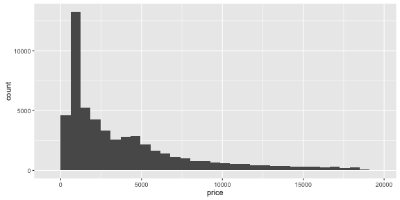 


---

### Gotchas

Easy to run into unhelpful errors


```r
library(ggplot2)
ggplot(airquality) # :(
```

```
## Error: No layers in plot
```

```r
ggplot(airquality, aes(temp)) # :'''(
```

```
## Error: No layers in plot
```

---

### Now make it fancier

Group diamonds by cut.


```r
m <- ggplot(diamonds, aes(price))
m + geom_histogram(aes(fill=cut))
```

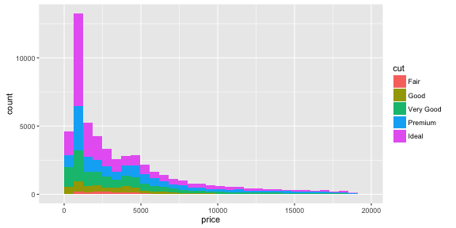 

---

### Facets are an alternative

Group diamonds by cut.


```r
m <- ggplot(diamonds, aes(price))
m + geom_histogram(binwidth=100) + facet_grid(cut~color)
```

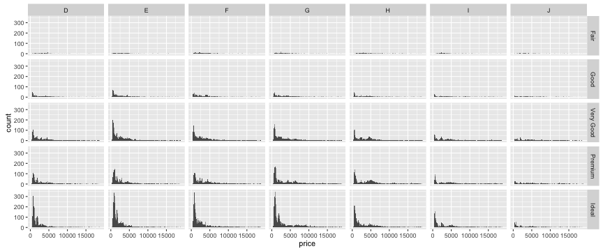 


---
### Let's pause for a moment

+ what's up with `aes`?
+ `aes(x, y, ...)`
+ allows functions of columns e.g. `aes(x=price^2)`, `aes(x=price/carat)`
+ what are layers?

```
m <- ggplot(diamonds, aes(price))
m + geom_histogram(aes(fill=cut))
```

+ note that plots can be built up _incrementally_
+ "Geoms, short for geometric objects, describe the type of plot you will produce."
+ geom names always begin with `geom_`

---
### Scatterplots

Note: There's no "scatterplot" function. Use `geom_point`.


```r
ggplot(diamonds, aes(price, carat)) + geom_point()
```

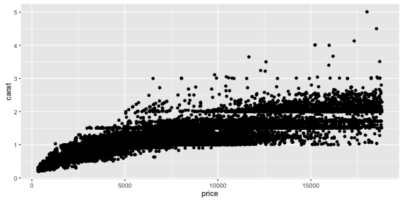 

---
### Log scales


```r
ggplot(diamonds, aes(price, carat)) + geom_point() + scale_x_log10()
```

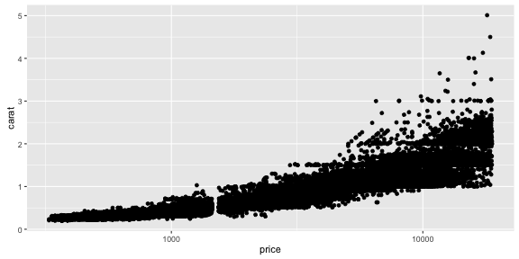 

Scales begin with `scale_`, and are not only for continuous variables: also `datetime`, `shape`, `colour`, etc

---
### Adding factors

Similar to histogram


```r
ggplot(diamonds, aes(price, carat)) + geom_point(aes(colour=color, shape=cut))
```

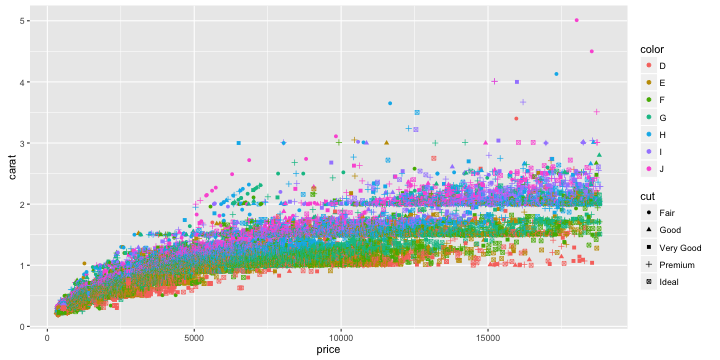 

Note the legend for each mapping!

---
### Overview of components

+ `geom_*` : Geoms, short for geometric objects, describe the type of plot you will produce.
+ `stat_*`: Statistical transformations transform your data before plotting
+ `scale_*`: Scales control the mapping between data and aesthetics.
+ `facet_*`: Facets display subsets of the dataset in different panels.
+ `coord_*`: Coordinate systems adjust the mapping from coordinates to the 2d plane of the computer screen.

And a few others...

---
### Problem: overplotting, approach 1a
Try lowering opacity


```r
ggplot(diamonds, aes(price, carat)) + geom_point(alpha=0.1)
```

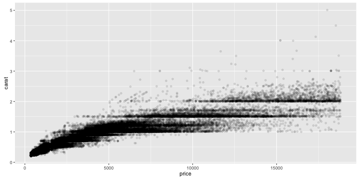 


---
### Problem: overplotting, approach 1b

Try mapping the inverse of a variable to opacity.


```r
ggplot(diamonds, aes(price, carat)) + geom_point(aes(alpha=1/carat))
```

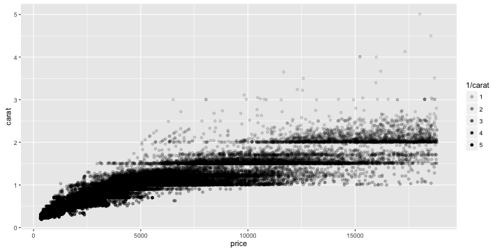 


---
### Problem: overplotting, approach 2

Shake the points around a little bit.


```r
ggplot(diamonds, aes(price, carat)) + geom_jitter()
```

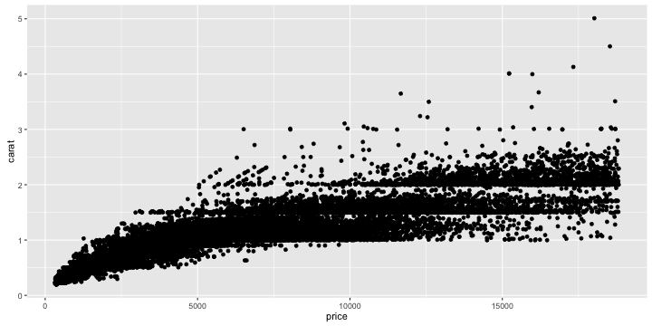 


---
### Problem: overplotting, approach 3

Bin into hexagons!


```r
library(hexbin)
ggplot(diamonds, aes(price, carat)) + geom_hex()
```

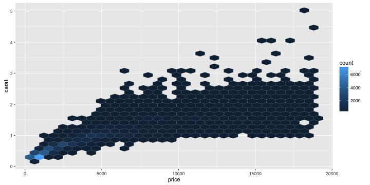 


---
### Problem: overplotting, approach 4

Smooth with a 2d density


```r
ggplot(diamonds, aes(price, carat)) + stat_density2d()
```

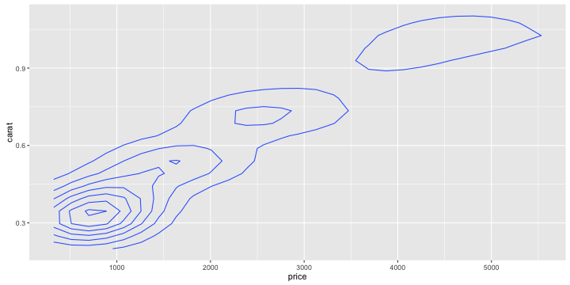 


---
### Something completely different: map!


```r
library(maps)
states <- map_data("state")
ggplot(states) + geom_polygon(aes(x=long, y=lat, group = group), colour="white")
```

 

---
### The world is your oyster


```r
ggplot(map_data("world")) + geom_polygon(aes(x=long, y=lat, group = group), colour="white")
```

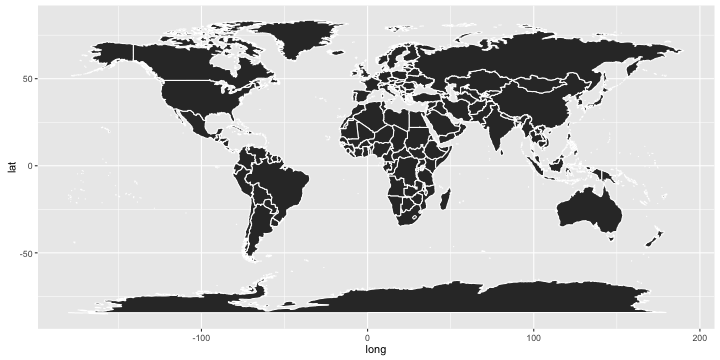 

---
### What's the point?


```r
ucs <- data.frame(lat=c(37.870007, 33.64945), long=c(-122.270501, -117.845707))
m <- ggplot(map_data("state"), aes(x=long, y=lat)) + geom_polygon(aes(group=group))
m + geom_point(data=ucs, colour="red", size=5)
```

 


---
### FYI

+ easy to add legend titles, axis labels, etc
+ `ggsave` function will save the plot to an image (or can just save via Rstudio)
+ `+ theme_bw()` will create a plot more suitable for printing
+ pie charts are possible but please do not make them
+ the `qplot` function is available as a more concise option
+ there are many packages that extend ggplot2's functionality!
+ e.g. `bdscale`, `GGally`, `xkcd`, `ggmap`

---

### Notes on oddities

+ normal R docs are not the best
+ excellent online documentation
+ default theme has grey background
+ uses British English spellings (e.g. "colour")


---


## EX10. Histogram for continuous variables
to check the outliers and the distribution of the variables
# 10.1 Histogram and pdf
generate a histogram for each continuous variable (mpg, displacement, horsepower, weight, acceleration) (manually plot each variable or use a for loop); save all plots in a pdf file and check the file (use pdf() and dev.off()). Need to install and load "ggplot2" package if you have not done so. 
# 10.2 (optional) Multiple histograms side-by-side
reshape the continuous-variable-subset of the data and use facet_grid to generate a graph that contains the histograms for all the continuous variables. Hint: melt the data so that the values of all variables go into one column and with another column (a factor) recording which variable the value is from. The variable names will be the levels of this factor. Save the graph in a pdf file and check the file. You will need the "reshape2" package.

---

## EX11. Boxplot
To check relationship between a continuous variable and a categorical variable
# 11.1 Boxplot of mpg by origin
Boxplot of mpg by origin to visually check if mpg is different across different countries of origin. First look up how to make a boxplot in the online ggplot2 documentation. In order for boxplot to work, make sure the variable for the x-axis (origin in this case) is converted to factor type. After you've generated the plots, you can see mpg does look different across different origin categories, suggesting mpg is likely to depend on the car origin. We will do a formal statistical test later. 
# 11.2 (optional) Show data points
add an additional layer a)geom_point or b)geom_jitter() and see what happens

---

## EX12. Scatterplot  
To check what the relationship of the two variables is like, e.g. linear or not. 
# 12.1 Scatterplot of mpg vs cylinders
to check the relationship and see if it is suitable to treat cylinder as a numerical variable (linear) or categorical variable (not linear). For this task, first check the use of stat_smooth() and the argument "method". Generate a scatter plot with the default smooth curve fit overlayed, and the other scatter plot with a linear regression fit overlayed (method="lm"). The two fitted curves should both have non-zero slopes but look quite different, suggesting mpg and cylinders are associated, but not linearly associated, in which case we want to keep cylinder as a categorical variable. You can see very few cases have cylinder = 3 or 5; sometimes you may want to do a secondary analysis with those cases removed. 
 
# 12.2 (optional) Scatterplot with odd cases removed
create another data with instances with odd number of cylinders removed, and check the above plots again. The two fitted curves look similar -> could treat cylinder as numerical. 

---


## EX13. Scatterplot matrix 
Apply function pairs() or ggpairs() on the data to create the scatterplot matrix. Save the plot in a pdf file. If you use ggpairs(), you need to install and load R package "GGally".   
  + to check the relationship between any pair of variable
  + to check for linearity assumption and homogeneity assumption
  + If violated, data transformation will be needed when building a linear regression model


---


## EX14. Data transformation
  + Based on scatterplot matrix, we see increasing variance as mpg increases, and also non-linear relationship between mpg and other variables. We need to transform the variables.
  + Add the following new variables to the data.  

# (a) Log transformation
  log transformed versions of mpg, horsepower, displacement, and weight; name the new variables as logmpg, loghorsepower, etc. Hint: to add a new variable, e.g. log of mpg, you can assign 'log(data**_**noNA$mpg)' to 'data**_**noNA$logmpg'. 
# (b) Numerical converted to Factor 
  a factor version of cylinders.

---

## EX15. Statistical analysis  
# 15.1 ANOVA for origin. 
To formally test whether mean mpg is different across cars of the three origins. Use significance level 0.05. First build a linear regression for mpg against origin. And then use both ANOVA() and summary() to check the results. 
# 15.2 Linear regression. 
Build a linear regression model to predict mpg. Include all other variables (use only the transformed version if available) (store the regression result in object 'model'); build another regression model using the same predictors but to predict log(mpg) (store in object 'model_log').
# 15.3 Regression results
Apply summary() on the regression objects and read the outputs. Is origin still helpful in predicting mpg/log(mpg) after including other predictors? 

---

# 15.4 Regression coefficients
Which column is to answer the relationship between mpg and other variables? 

# 15.5 Make prediction
Run "newcase = data**_**noNA[1:10,]" to take the first 10 instances, and treat them as some new cars for which we want to predict mpg. Use predict() to predict mpg for them using respectively the object "model" and "model**_**log". Keep in mind that from "model**_**log", predict() returns the predictions for log(mpg) instead of mpg. 
predict(model, newcase)
exp(predict(model_log, newcase))

# 15.6 Diagnostics
Diagnostics is important in statistical analysis. Execute plot(model) and plot(model_log) in R and check the four plots for each model. Based on the diagnostic plots, are these reasonable models? Which one is better? Check the following aspects.  
    + (a) linearity assumption
    + (b) normality assumption
    + (c) constant variance
    + (d) outliers

---

## EX16. (optional) Adjusting opacity for plotting
An independent exercise: play with opacity setting for scatterplot of carat vs price for the diamond data. Set alpha to be different functions of the variables and see what happens 

---

## Online Resources to Learn R:

> 1. Very useful resources available on **The Comprehensive R Archive Network** (CRAN)
  + please visit: http://cran.us.r-project.org

> 2. R built-in facility:
  + try ?lm, help(lm) in R console

> 3. There are many free tutorials available online:
  + Quick R: http://www.statmethods.net/
  + R-Twotorials: http://www.twotorials.com/
  + UCLA Academy Technology Services: http://www.ats.ucla.edu/stat/r/
  
> 4. R-Bloggers (http://www.r-bloggers.com/): is a central hub (e.g: A blog aggregator) of content collected from bloggers who write about R (in English). 


---

## Useful Books in learning R:

1. Chambers(1998). Programming with Data, Springer.

2. Venables & Ripley (2000). S Programming, Springer.

3. Chambers (2008). Software for Data Analysis, Springer. (highly recommended)

4. More resources available at: http://www.r-project.org/doc/bib/R-books.html

---

## How to get help in R:

1. Simply use the built-in help function in R
  + example: ?lm, help(lm)
  
2. R mailing lists: r-help and r-devel
  + For more info: https://stat.ethz.ch/mailman/listinfo/r-help
  + How to ask good questions: http://www.r-project.org/posting-guide.html

3. Use Q&A websites in particular:
  + stackoverflow (http://stackoverflow.com): for programming related questions.
  + crossValidated (http://stats.stackexchange.com): for Stats related questions.
  
4. Google :)  
